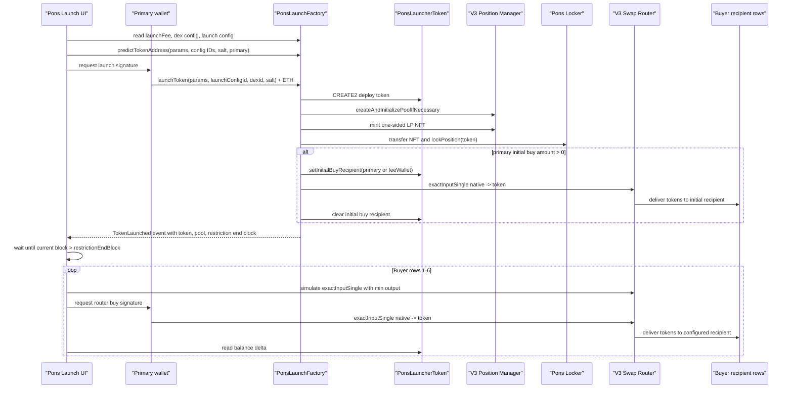

# Pons Launch Contract Analysis

Source: https://robinhoodchain.blockscout.com/address/0xA5aAb3F0c6EeadF30Ef1D3Eb997108E976351feB?tab=contract

## Summary

- Launch contract: `0xA5aAb3F0c6EeadF30Ef1D3Eb997108E976351feB`
- Contract name: `PonsLaunchFactory`
- Chain: Robinhood Chain
- Chain ID: `4663`
- Compiler: `v0.8.30+commit.73712a01`
- Current implementation mode: **Mode B: launch followed by signed wallet/router transactions**

The existing factory can atomically deploy a token, initialize a Uniswap V3 pool, mint and lock the LP NFT, and optionally execute exactly one initial native-token buy. It does not support multiple buyer recipients in `launchToken`, does not expose multicall/arbitrary calls, and the launched token blocks non-exempt buys in the launch block. Therefore seven purchases cannot be performed atomically through the existing contract.

## Live Configuration

Queried on Robinhood Chain:

- `launchFee`: `500000000000000` wei (`0.0005 ETH`)
- `launchEnabled`: `true`
- `locker`: `0x736D76699C26D0d966744cAe304C000d471f7F35`
- `dexConfigCount`: `1`
- `launchConfigCount`: `1`

DEX config `0`:

- Name: `uniswap v3`
- Factory: `0x1f7d7550B1b028f7571E69A784071F0205FD2EfA`
- Position manager: `0x73991a25C818Bf1f1128dEAaB1492D45638DE0D3`
- Swap router: `0xCaf681a66D020601342297493863E78C959E5cb2`
- Pool fee: `10000`
- Tick spacing: `200`
- Enabled: `true`

Launch config `0`:

- Pair token / wrapped native: `0x0Bd7D308f8E1639FAb988df18A8011f41EAcAD73`
- Graduation threshold: `4200000000000000000`
- Initial tick: `-204200`
- Supply: `1000000000000000000000000000`
- Max wallet bps: `500`
- Max tx bps: `550`
- Restriction blocks: `2`
- Reserved fee: `0`
- Enabled: `true`
- Router requires deadline: `false`

## Relevant Function Selectors

- `0x686399cb` `launchToken((string,string,string,string,(string,string,string,string,string),address),uint256,uint256,bytes32)`
- `0xea9d3fdc` `predictTokenAddress((string,string,string,string,(string,string,string,string,string),address),uint256,uint256,bytes32,address)`
- `0x710bb94c` `getDexConfig(uint256)`
- `0x1cad862d` `getLaunchConfig(uint256)`
- `0x3cf28b5a` `getLaunchedToken(address)`
- `0xcf3cf573` `launchFee()`
- `0x236a4afb` `launchEnabled()`
- `0xd7b96d4e` `locker()`

## Important Events

- `TokenDeployed(address indexed token,address indexed deployer,address indexed dexFactory,address pairToken,uint256 dexId,uint256 launchConfigId)`
- `TokenLaunched(address indexed token,address indexed deployer,address indexed dexFactory,address pairToken,address pool,uint256 dexId,uint256 launchConfigId,uint256 positionId,uint256 restrictionsEndBlock,uint256 initialBuyAmount)`

The frontend decodes `TokenLaunched` from the launch receipt to recover the token, pool, position id, restriction end block, and initial buy amount.

## Launch Function

```solidity
function launchToken(
    TokenParams calldata params,
    uint256 launchConfigId,
    uint256 dexId,
    bytes32 salt
) external payable nonReentrant returns (address token)
```

`TokenParams` fields:

- `name`
- `symbol`
- `logo`
- `description`
- `socials.twitter`
- `socials.telegram`
- `socials.discord`
- `socials.website`
- `socials.farcaster`
- `feeWallet`

Required `msg.value`:

- Must be at least `launchFee`.
- Any excess `msg.value - launchFee` becomes the single atomic initial buy amount.
- There is no refund of unused native currency in `launchToken`; all excess value is spent as the initial buy.

Return value:

- The newly deployed token address.

## Token Address Derivation

The token is deployed using `CREATE2`.

The factory computes:

```solidity
address(uint160(uint256(keccak256(
    abi.encodePacked(bytes1(0xff), address(this), salt, keccak256(creationCode))
))))
```

The creation code includes token params, launch config, DEX config, and the `tokenDeployer` (`msg.sender`). The token address can be predicted before launch using `predictTokenAddress`.

## Pool Address Derivation

The pool is a Uniswap V3 pool created through:

```solidity
manager.createAndInitializePoolIfNecessary(token0, token1, poolFee, sqrtPriceX96)
```

The pool can be checked through the configured V3 factory:

```solidity
getPool(token, pairToken, poolFee)
```

Before launch, `launchToken` reverts if a pool already exists for the predicted token, pair token, and fee.

## Liquidity Path

The factory:

1. Deploys `PonsLauncherToken`.
2. Creates and initializes the V3 pool.
3. Approves `config.supply` to the position manager.
4. Mints a one-sided V3 position into the factory.
5. Transfers the position NFT to the locker.
6. Calls `lockPosition(token)`.

Liquidity position range:

- If launched token is token0: `[initialTick, maxUsableTick]`
- If launched token is token1: `[minUsableTick, -initialTick]`

## Trading Path

Initial buy path:

- Native ETH enters `launchToken`.
- `launchFee` is paid to the locker protocol fee recipient.
- Remaining native ETH is sent into the configured V3 router.
- Router swaps from `pairToken` / wrapped native into the launched token.
- Recipient is `params.feeWallet` if nonzero, otherwise `msg.sender`.

Later buy path:

- The UI submits `exactInputSingle` to the configured V3 router.
- `tokenIn` is the configured pair token.
- `tokenOut` is the launched token.
- `recipient` is the configured buyer recipient address.

## Initial Buy Behavior

The factory supports one optional initial buy only:

```solidity
uint256 initialBuyAmount = msg.value - launchFee;
```

If `initialBuyAmount != 0`, the factory sets the token's one-call initial-buy exemption, executes the router swap, then clears the exemption.

Important limitation: the factory hardcodes `amountOutMinimum: 0` for the atomic initial buy. The UI can warn about this, but cannot change it without a new launch contract or helper.

## Restrictions

`PonsLauncherToken` applies restrictions to pool-to-user buys through `restrictionEndBlock`:

- Non-exempt buys in the launch block revert with `LaunchBlockBuyBlocked`.
- During the restricted window, max wallet and cumulative pool-buy limits apply.
- Live config uses `restrictionBlocks = 2`, `maxWalletBps = 500`, and `maxTxBps = 550`.

This is the main reason same-block extra purchases cannot be supported by the existing contract.

## Access Controls

Owner-only functions:

- `addDexConfig`
- `setDexStatus`
- `addLaunchConfig`
- `updateLaunchConfig`
- `setLaunchFee`
- `setLaunchEnabled`
- `setWhitelistedLauncher`

Public launch gate:

- If `launchEnabled == false`, only `whitelistedLaunchers[msg.sender]` can call `launchToken`.

## Reentrancy Considerations

`launchToken` is protected with `nonReentrant`. It calls external contracts: the locker, position manager, and router. The factory records launched-token state before executing the initial buy and uses a temporary token-side exemption for exactly one recipient during the atomic buy.

## Refund Behavior

No explicit refund was found in `launchToken`. `launchFee` is paid out; all remaining native value is treated as the initial buy amount.

## Seven-Purchase Workflow

Possible: **partially, in Mode B only**.

- Primary wallet can launch and optionally perform one atomic initial buy.
- Buyer rows 1-6 cannot be included inside the same factory transaction.
- The existing factory does not accept multiple recipients or buy instructions.
- The token blocks non-exempt buys in the launch block.
- Later buys must be submitted after the restriction window has passed, through the configured V3 router.
- Same-block inclusion is not guaranteed.

## Selected Mode

**Mode B: Launch followed by signed wallet transactions.**

Reason:

- Atomic launch plus one initial buy is supported.
- Atomic launch plus seven recipient buys is not supported.
- There is no factory multicall, arbitrary-call mechanism, callback hook, or multiple-recipient buy input.
- Launch-block extra buys revert unless they are the factory's temporary initial-buy recipient.

## Mermaid Flow



## Assumptions and Remaining Confirmations

- The configured pair token behaves as wrapped native for payable router swaps.
- The configured router accepts native ETH in `exactInputSingle`.
- The frontend currently uses the connected primary wallet to fund later recipient buys. It does not connect six independent wallet sessions.
- Independent buyer signing would require a wallet-connection architecture beyond the current Vite/ethers app.
- Quoted expected output before launch is limited because the pool does not exist yet; later buys are simulated after token and pool detection.
