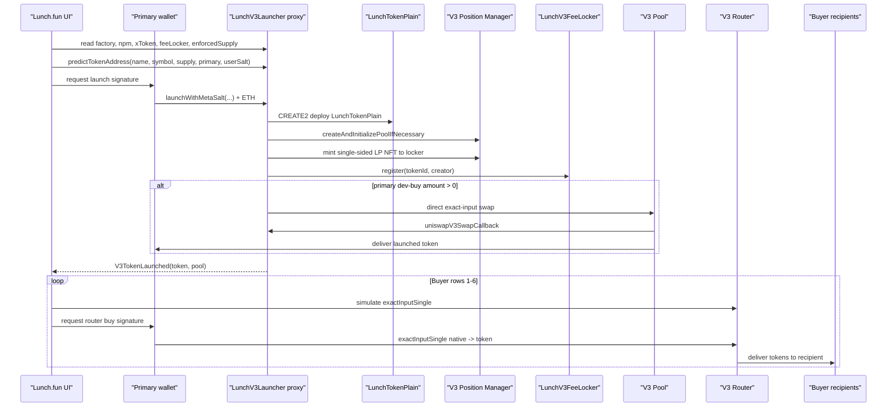

# Lunch.fun Launch Contract Analysis

Source proxy: https://robinhoodchain.blockscout.com/address/0xf5Ac14e7691EF44b15b59FcC6a756e41A3E5EFd6?tab=contract_code

Attached implementation source: `LunchV3LauncherSingle`

## Summary

- Launch proxy: `0xf5Ac14e7691EF44b15b59FcC6a756e41A3E5EFd6`
- Implementation: `0xc419ba7b9c32103ab8b1a04de4ea2ed518e03749`
- Contract: `LunchV3LauncherSingle`
- Chain: Robinhood Chain
- Chain ID: `4663`
- Compiler: `v0.8.30+commit.73712a01`
- Selected implementation mode: **Mode B: launch followed by signed router transactions**

The launcher can atomically deploy the token, create/init the Uniswap V3 pool, mint and register locked liquidity, emit metadata, and optionally execute one creator dev-buy. It does not accept multiple buy recipients and does not expose multicall/arbitrary call functionality for seven buys in one outer transaction.

## Live Configuration

Queried from the proxy:

- Factory: `0x1f7d7550B1b028f7571E69A784071F0205FD2EfA`
- Position manager: `0x73991a25C818Bf1f1128dEAaB1492D45638DE0D3`
- Wrapped native / X token: `0x0Bd7D308f8E1639FAb988df18A8011f41EAcAD73`
- Fee locker: `0x3201B49b295eE95E70bdBe0b07dF28A7FF1cA9C5`
- Launch fee: `0`
- Enforced supply: `1000000000000000000000000000`
- Launch tick magnitude: `204200`
- Required pool fee tier: `10000`
- allTokensLength at inspection: `306`

## Relevant Selectors

- `0x85b201b6` `launchWithMeta(string,string,uint256,uint24,uint256,Meta)`
- `0xa61c7ab7` `launchWithMetaSalt(string,string,uint256,uint24,uint256,Meta,bytes32)`
- `0x4cd1b00d` `launchWithMetaSaltRef(string,string,uint256,uint24,uint256,Meta,bytes32,address)`
- `0x79c6de28` `predictTokenAddress(string,string,uint256,address,bytes32)`
- `0xf5dab711` `tokenInfo(address)`
- `0x83eeb3bb` `launchFeeWei()`
- `0xcf404eff` `enforcedSupply()`
- `0xc45a0155` `factory()`
- `0x7f1e9ef6` `npm()`
- `0x088b699e` `xToken()`
- `0x70e9d244` `feeLocker()`

## Important Events

- `V3TokenLaunched(address indexed token,uint256 indexed tokenId,address indexed creator,address pool,uint24 fee)`
- `V3BandsLaunched(address indexed token,uint256 curveTokenId,uint256 tailTokenId,int24 launchTick,int24 midTick,uint256 band1Tokens,uint256 band2Tokens)`
- `V3SaltedLaunch(address indexed token,bytes32 userSalt)`
- `V3TokenMeta(address indexed token,address indexed creator,string image,string banner,string description,string website,string twitter,string telegram)`

The frontend decodes `V3TokenLaunched` from the launch receipt to detect token and pool.

## Launch Function Used

The UI uses:

```solidity
launchWithMetaSalt(
    string name,
    string symbol,
    uint256 totalSupply,
    uint24 fee,
    uint256 initialBuyMaxTokens,
    Meta meta,
    bytes32 userSalt
) payable returns (address token, uint256 tokenId)
```

Reason: this gives deterministic prediction through `predictTokenAddress` and emits token metadata in the same transaction.

Required `msg.value`:

- Must be at least `launchFeeWei`.
- If `msg.value > launchFeeWei` and `initialBuyMaxTokens > 0`, all extra ETH is used for the creator dev-buy.
- If `msg.value > launchFeeWei` and `initialBuyMaxTokens == 0`, the extra ETH is refunded to the creator.

Important: `initialBuyMaxTokens` is a flag, not a cap. Any positive value enables the dev-buy.

## Token Address Derivation

The salted path uses `CREATE2`.

The final salt is:

```solidity
keccak256(abi.encode(msg.sender, userSalt))
```

The token address is predicted through:

```solidity
predictTokenAddress(name, symbol, totalSupply, creator, userSalt)
```

The predicted address depends on the creator address, token params, launcher address, user salt, and current implementation bytecode.

## Pool Derivation

The pool is created with:

```solidity
npm.createAndInitializePoolIfNecessary(token0, token1, fee, sqrtLaunch)
```

The launcher requires the live pool price to equal the intended launch price:

```solidity
require(livePrice == sqrtLaunch, "pool pre-initialized");
```

## Liquidity Path

The current implementation deploys `LunchTokenPlain` and mints one full-range single-sided V3 position containing the entire project-token supply. The NFT is minted directly to the fee locker and registered to the creator.

Live token implementation notes:

- Fixed supply
- Immutable / non-upgradeable token
- No transfer restrictions
- No privileged mint/burn functions

## Trading Path

Atomic creator dev-buy:

1. ETH after `launchFeeWei` is wrapped into `xToken`.
2. Launcher calls the V3 pool directly through `pool.swap`.
3. `uniswapV3SwapCallback` pays the pool in `xToken`.
4. Project tokens are sent to the creator.
5. Unused wrapped native from this buy is unwrapped and refunded.

Later recipient buys:

- The UI uses the configured V3 router `exactInputSingle`.
- `tokenIn = xToken`
- `tokenOut = launched token`
- `fee = 10000`
- `recipient = configured recipient`
- `amountOutMinimum = user configured minimum`

## Atomicity Classification

Selected mode: **Mode B**.

Why:

- The launcher supports only one creator dev-buy.
- It does not accept arrays of buyers, recipients, amounts, or minimum outputs.
- It has no multicall or arbitrary-call hook.
- Later buys must be separate router transactions.
- Same-block ordering cannot be guaranteed without validator/sequencer/private bundle support.

## Refund Behavior

- If extra ETH is provided but `initialBuyMaxTokens == 0`, the launcher refunds it to `msg.sender`.
- During an enabled dev-buy, unused wrapped native attributable to that buy is unwrapped and refunded.
- Launch fee remains in the launcher and can be withdrawn by owner.

## Access Controls

Owner-only functions include:

- UUPS upgrade authorization
- Fee and locker settings
- Launch tick magnitude
- Enforced supply
- Fee locker register gas
- Referral splitter
- Token rescue

The launch functions themselves are public.

## Reentrancy Considerations

All public launch entry points are `nonReentrant`. The swap callback only accepts calls from the currently active pool during the direct dev-buy.

## Seven-Purchase Workflow

Possible: **partially, in Mode B only**.

- Primary wallet launches.
- Primary wallet may perform one atomic dev-buy.
- Additional rows are recipient addresses for later router buys funded by the connected primary wallet.
- Independent additional wallet sessions are not implemented in this Vite app.
- Same-block inclusion is not guaranteed.

## Mermaid Flow



## Assumptions and Unsupported Behavior

- Later buys use the same V3 router address used by the Pons config unless changed in the UI.
- Expected output before launch is limited because the token/pool do not exist until launch confirms.
- The UI requires nonzero user minimum output for later buys; the atomic creator dev-buy has no configurable min output in the existing contract.
- A helper/executor contract was not added.
